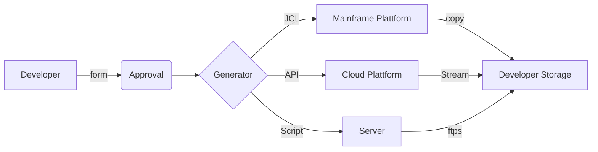

# Pushing technology the hard way (Part1)

  
This blog is for employees who want to help their organizations moving forward with the latest and greatest technology. Follow us on a bold journey close to the action with real-world examples. In this blog, we will explain how to innovate in big companies and provide a step by step guidance. The real-world examples are from an undisclosed IT service provider hosting over 2000 servers and 16000 virtual machines and the innovative project is about introducing [immudb](https://www.codenotary.com/technologies/immudb/), the world’s fastest immutable database.

  

## Why is it important but so difficult?

The C-Suite loves innovation, they want new ideas and the fruits of the latest and greatest technologies. They are openly communicating that. Innovation is vital to keep an organization relevant. Unfortunately adopting new technologies is very hard, especially for big enterprises. The reasons are plentiful. The communication overhead can be massive. Headcount is always slowing down organizations. Inflexible processes are a challenge for every new approach. Legacy-IT and day-to-day business are holding back employees from innovative projects. Those projects are so fragile that some companies even put them in technology incubators. It is a challenge but a rewarding one as innovation can increase competitiveness, productivity and lead to new collaborations. The executives obviously want to encourage employees to innovate, asking for creativity and openness. Attributes that are not positively correlated to most of the actual work that has to be done in businesses. That's why only a few people are taking up on that call and do it.


## How can it be done?

There is always a silver lining: huge organizations also have some advantages on their side. They have a lot of resources and many employees. Use these resources whenever possible. Adapt to the speed of the company. If things are going slow, turn it in your favor instead of fighting it. Do many small steps instead of chasing major progress. That way your colleagues will keep up with you. Don't be scared by negative feedback. Every executive loves innovative employees so there is nothing wrong with you. Last but not least: big businesses can provide many potential use-cases. Go for the niche use cases that really work well for your project. Thinking too big is adding additional risks.

  


  

## What needs to be done?

  

Find the lab! Set up your technology in a lab environment to easily share and to learn about it. This will make it visible and is already a small success. Create an info page about your project. Explain why, how, and what you want to achieve to make it well comprehensible. Identify use-cases for the technology inside your organization and find companions for your project.

  
  

## Real-world example

  

How do the actions described above apply in reality? The following examples are from a project that introduces [immudb](https://www.codenotary.com/technologies/immudb/) to a huge IT company.

  

1. setting up [immudb](https://www.codenotary.com/technologies/immudb/) in a lab environment

2. creating an info/home page for the project

3. identifying use cases

  

### 1. Setting up the lab environment

There were two lab environments found in the company of this example. One was outside the internal network and manually managed. The other one was the lab of a cloud platform [Cloud Foundry](https://www.cloudfoundry.org/) with a self-service. The lab of the cloud platform was better suited because every employee can reach it from the internal network and it was provided quickly via self-service.

  

Setting up [immudb](https://www.codenotary.com/technologies/immudb/) in cloud foundry:

```

#create an org and a Space for immudb

cf create-org YOURLAB

cf create-space IMMUDB -o YOURLAB -q SPACE_QUOTA

```

Open the [Ports](https://docs.cloudfoundry.org/devguide/custom-ports.html). Immudbs standard ports are 8080 for the web interface and 3322 for gRPC. Add persistent storage to your ORG using [volume services](https://docs.cloudfoundry.org/devguide/services/using-vol-services.html). Without persistent storage, your immudb app will always be wiped if the org is reinitialized. In that case, it is also a good idea to change the initial password.

  

Prepare your [immudb](https://www.codenotary.com/technologies/immudb/) installation:

``` config

#immudb/configs/immudb.toml

dir = "./<path to volume>"

network = "tcp"

address = "0.0.0.0"

port = 3322

dbname = "immudb"

admin-password = "XXXXXXX"

```

[immudb](https://www.codenotary.com/technologies/immudb/) can be compiled on the personal computer or with a golang buildpack of cloud foundry. In this case, it was built with immudb's web interface and customized config. The executable was pushed using a binary build pack and executed by the command: ./immudb

```$ cf push IMMUDB -c './immudb' -b binary_buildpack```

```

#minimal manifest for testing

applications:

- name: immudb

instances: 1

memory: 1024M

disk_quota: 400M

path: ./target/immudb
```
You app can now be seen in the [Apps Manager].(https://docs.pivotal.io/application-service/2-8/console/index.html)

Anyone in the company can now try out immudb via the webinterface. Simply create a user and a database for them. This can also be done in the webinterface using the initial user & password combination.


  

### 2. Setting up an info page

Info pages were found on [Confluence](https://www.atlassian.com/de/software/confluence) and [SharePoint](https://www.microsoft.com/de-de/microsoft-365/sharepoint/collaboration). The info page about [immudb](https://www.codenotary.com/technologies/immudb/) was created on [Confluence](https://www.atlassian.com/de/software/confluence) because it is more future proof. It is structured by the why, how, and what method summing up the key information from the official [immudb documentation](https://docs.immudb.io/master/about.html#what-is-immudb). It was also translated into the official language of the company. Potential use cases will be added to the page.

  

### 3. Identifying use cases

Looking up the [known use cases](https://docs.immudb.io/master/about.html#how-can-i-use-immudb) of immudb is a great inspiration for finding one yourself. The use case chosen in this example is about protecting the process of deploying customer data to the devs in order to fix program errors. Although the use case is pretty niche, it can be a good first step without a lot of complexity.  This use case is closely related to the protection of CI/CD piplines of the [offical docs](https://docs.immudb.io/master/about.html#how-can-i-use-immudb). The use case was chosen because the specific team of the project leader is owning the process, which makes things a lot easier. Currently the process looks like this:


The Developer should only get the data that he requested. The generator is creating the code that is being used for deploying that data to the dev's storage using code templates that should not be changed.  The input of the form is being inserted in those templates. The resulting code is being run on the platforms and unloads the requested data on the dev's storage. Immudb will be used to make sure that the request of the dev is properly generated and executed as well as to capture the results. This will enable an auditable, tamperproof way of accessing customer data for testing. 

  
  

## Next steps
Now the software for the project is visible and can be demonstrated in the lab. Convincing colleagues is key to get a foot in the door. The next step is to work out the use-case to create value no matter how niche it is. For that, we have to outgrow the lab environment and set a proper foundation. 
